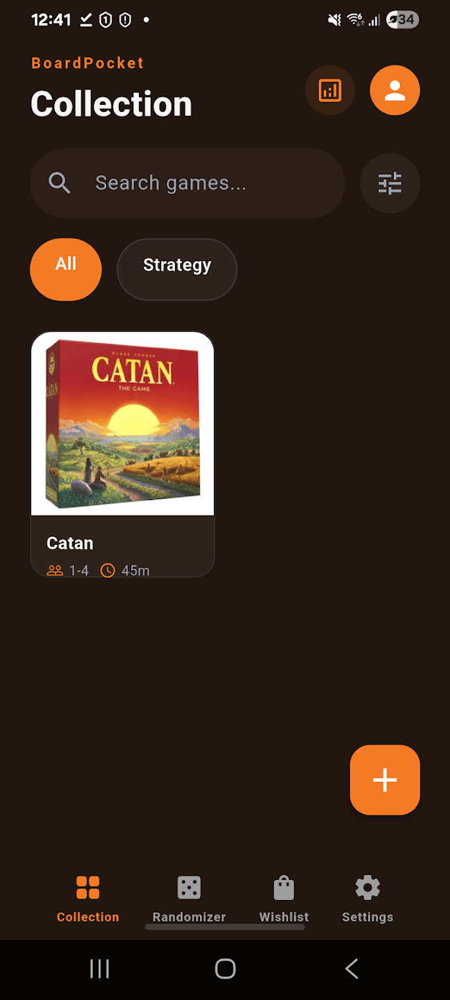
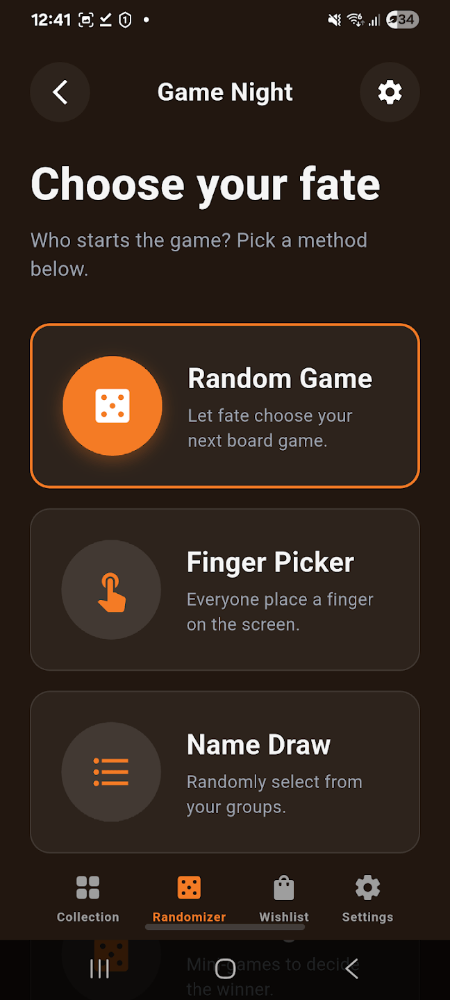
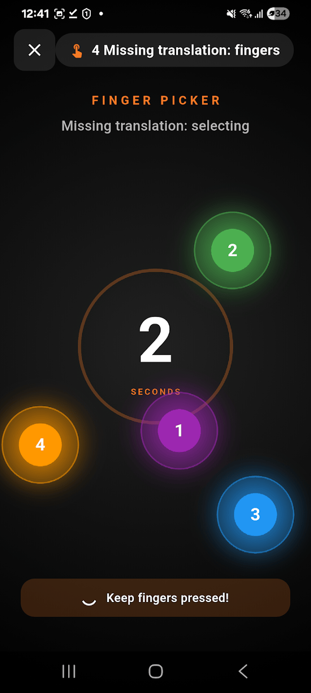
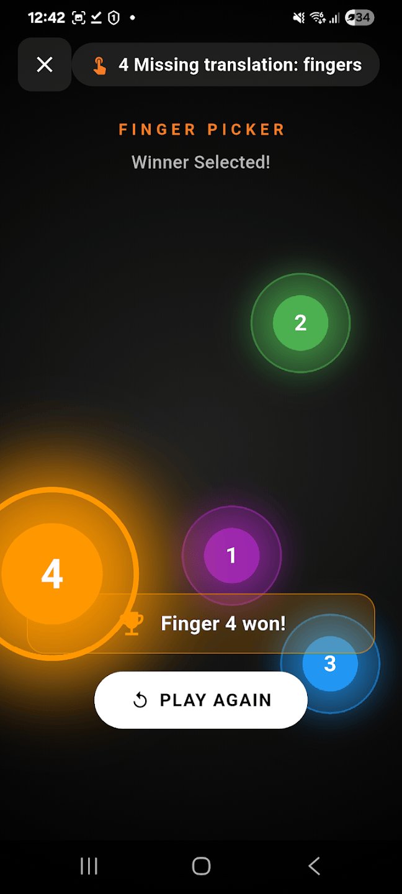

# BoardPocket

<p align="center">
  
</p>

<p align="center">
  <strong>Your digital companion for board game nights</strong>
</p>

<p align="center">
  <a href="#-features">Features</a> •
  <a href="#-screenshots">Screenshots</a> •
  <a href="#-installation">Installation</a> •
  <a href="#-getting-started">Getting Started</a> •
  <a href="#-tech-stack">Tech Stack</a> •
  <a href="#-contributing">Contributing</a> •
  <a href="#-license">License</a>
</p>

<p align="center">
  
  
  
  
</p>

<p align="center">
  
  
</p>

---

## 📱 Overview

**BoardPocket** is a comprehensive Flutter application designed for board game enthusiasts. It helps you manage your game collection, track plays, maintain a wishlist, and make game nights more fun with built-in randomizers and decision-making tools.

Whether you're a casual player or a serious collector, BoardPocket provides everything you need to enhance your board gaming experience.

## ✨ Features

### 🎲 Game Collection Management
- **Digital Collection**: Keep track of all your board games in one place
- **Game Details**: Store comprehensive information including title, player count, play time, category, and complexity
- **Cover Images**: Upload high-resolution cover images for each game
- **Statistics**: Track total plays, win rates, and last played dates
- **Categories**: Organize games by category with easy filtering
- **Search**: Quickly find games with the built-in search functionality

### 🎰 Game Night Tools
- **Random Game Picker**: Can't decide what to play? Let the app choose for you!
- **Finger Picker**: Interactive tool to randomly select who starts by touching the screen
- **Name Draw**: Draw random names from your player groups
- **Challenge Mode**: Built-in mini-games and challenges to decide the winner

### 📋 Wishlist
- **Track Desired Games**: Keep a list of games you want to buy
- **Filter Options**: Organize by category or priority
- **Easy Management**: Add, edit, and remove items seamlessly

### 🎨 Customization
- **Dark/Light Mode**: Choose your preferred theme
- **Multi-language Support**: Available in English, Portuguese, and Spanish
- **Responsive Design**: Works beautifully on phones and tablets

### 💾 Data Management
- **Export/Import**: Backup your entire collection as JSON
- **Cross-Platform**: Works on Android, iOS, and Web
- **Local Storage**: Your data stays on your device (with SQLite)

## 📸 Screenshots

<p align="center">
  
  
  
  
</p>

## 🚀 Installation

### Prerequisites
- Flutter SDK (^3.11.0)
- Dart SDK
- Android Studio / Xcode (for mobile development)
- Chrome (for web development)

### Clone the Repository

```bash
git clone https://github.com/Oda2/boardpocket.git
cd boardpocket
```

### Install Dependencies

```bash
flutter pub get
```

### Run the App

```bash
# For Android
flutter run

# For iOS
flutter run -d ios

# For Web
flutter run -d chrome
```

### Build for Production

```bash
# Android APK
flutter build apk --release

# Android App Bundle
flutter build appbundle --release

# iOS
flutter build ios --release

# Web
flutter build web --release
```

## 🎯 Getting Started

### First Launch
1. Open the app and explore the **Collection** tab
2. Tap the **+** button to add your first board game
3. Fill in the game details and upload a cover image
4. Explore the **Randomizer** tab for game night tools
5. Add games to your **Wishlist** for future purchases

### Adding a Game
1. Tap the **+** button in the Collection tab
2. Enter the game title
3. Set player count (min and max)
4. Select play time and complexity
5. Choose a category
6. Upload a cover image
7. Save!

### Using Randomizers
- **Random Game Picker**: Go to Randomizer → Random Game and tap the button
- **Finger Picker**: Everyone touches the screen, the app selects randomly
- **Name Draw**: Add player names and draw to see who goes first
- **Challenge**: Try the built-in challenges for extra fun

## 🛠 Tech Stack

- **Framework**: Flutter
- **Language**: Dart
- **State Management**: Provider
- **Navigation**: go_router
- **Database**: SQLite (sqflite)
- **Web Fallback**: SharedPreferences
- **Storage**: path_provider
- **Image Handling**: image_picker
- **File Operations**: file_picker, share_plus
- **UI Components**: Material Design + Google Fonts
- **Internationalization**: intl

## 🤝 Contributing

We love contributions! Here's how you can help:

### Reporting Bugs
- Check if the bug has already been reported in [Issues](https://github.com/Oda2/boardpocket/issues)
- If not, create a new issue with a clear description and steps to reproduce

### Suggesting Features
- Open an issue with the label `enhancement`
- Describe the feature and why it would be useful

### Pull Requests
1. Fork the repository
2. Create a new branch (`git checkout -b feature/amazing-feature`)
3. Make your changes
4. Commit your changes (`git commit -m 'Add amazing feature'`)
5. Push to the branch (`git push origin feature/amazing-feature`)
6. Open a Pull Request

### Code Style
- Follow the existing code style
- Run `flutter analyze` before committing
- Ensure all tests pass (`flutter test`)

## 🗺 Roadmap

- [X] Board game statistics and analytics dashboard
- [X] Player profiles and win/loss tracking
- [?] Integration with BoardGameGeek API
- [ ] Game recommendations based on collection
- [ ] Social features (share collections)
- [ ] Game session timer
- [ ] Score keeping tools
- [ ] Barcode scanner for quick game addition

## 🌟 Support

If you find this project helpful, please consider:
- ⭐ Starring the repository
- 🐛 Reporting bugs
- 💡 Suggesting features
- 🔧 Contributing code

## 📜 License

This project is licensed under the MIT License - see the [LICENSE](LICENSE) file for details.

## 🙏 Acknowledgments

- Thanks to all contributors who helped make this project better
- Flutter community for amazing packages and support
- Board game enthusiasts worldwide for the inspiration

## 📞 Contact

- **GitHub Issues**: [Create an issue](https://github.com/Oda2/boardpocket/issues)

---

<p align="center">
  <strong>Made with ❤️ for board game lovers</strong>
</p>

<p align="center">
  <a href="https://github.com/Oda2/boardpocket">
    
  </a>
  <a href="https://github.com/Oda2/boardpocket/graphs/contributors">
    
  </a>
</p>
